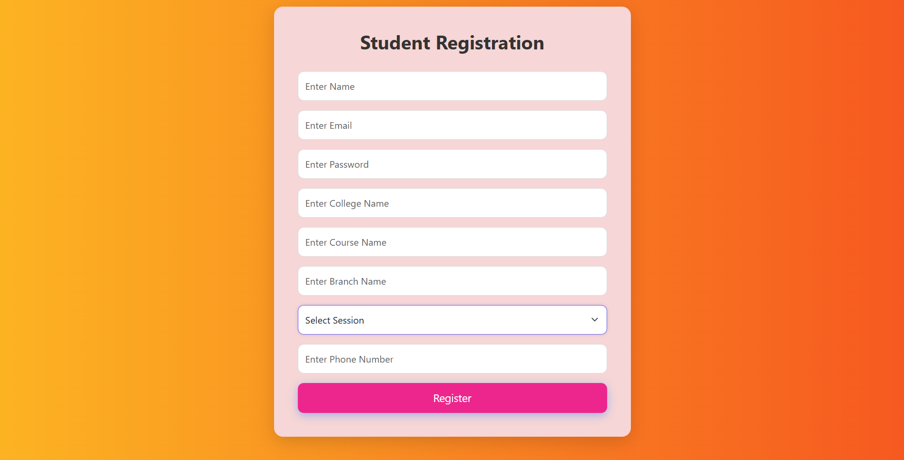
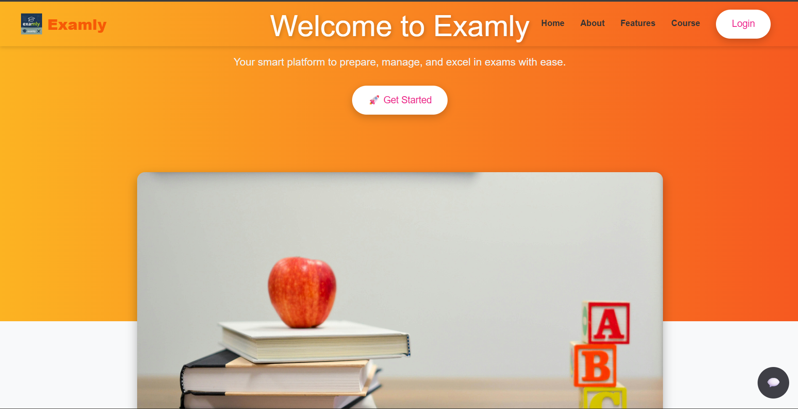
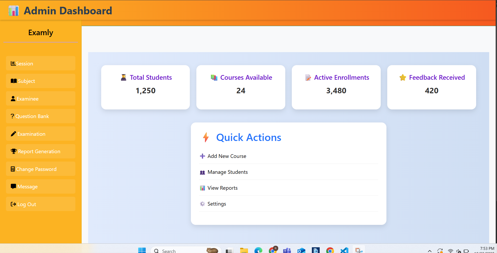
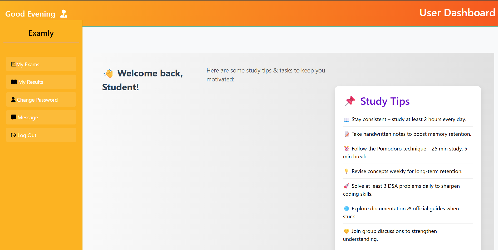
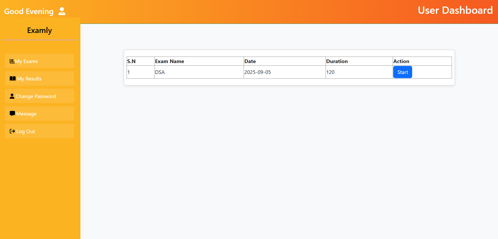
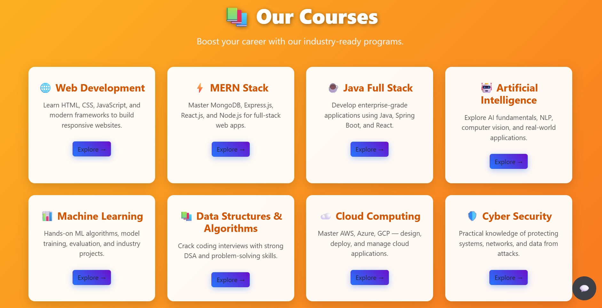
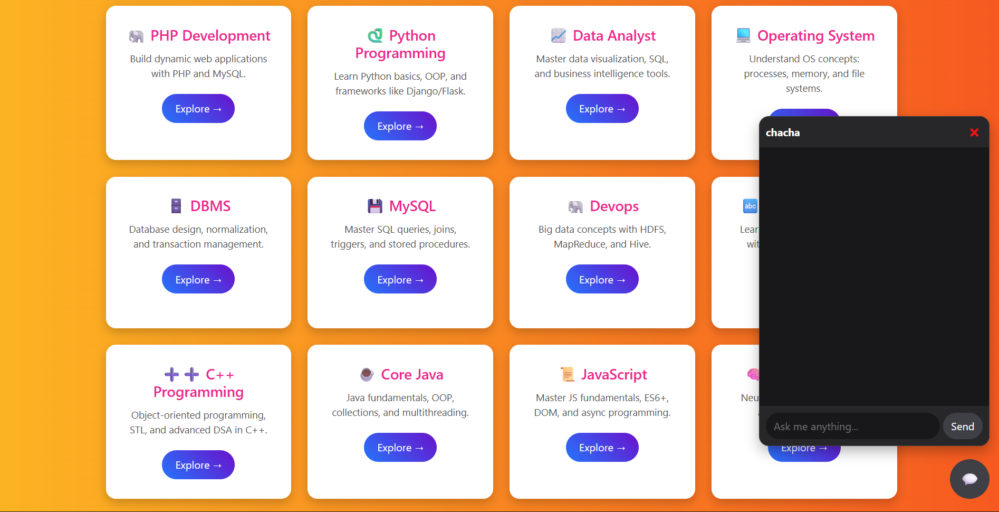

# 🎓 Examly — Online Examination Platform

**Examly** is a full-stack **MERN (MongoDB, Express, React, Node.js)** based online examination platform designed for **university-level assessments**.
It provides separate dashboards for **Admin** and **Users**, enabling secure exam management, participation, and learning through additional resources like free courses and an AI chatbot.

---

## 🚀 Features

### 👨‍💼 Admin Dashboard

* Create and manage university-level exams
* Schedule examinations
* Monitor student participation
* Manage users and exam results
* Dashboard analytics

### 👨‍🎓 User Dashboard

* Register & login securely
* Attempt available exams
* View results and performance
* Access free learning courses
* Chatbot assistance for queries

### 🤖 Additional Modules

* AI Chatbot support
* Free courses section
* Real-time exam interaction
* Role-based authentication (Admin/User)

---

## 🧱 Tech Stack

### Frontend

* React.js
* Axios
* Tailwind CSS / CSS

### Backend

* Node.js
* Express.js

### Database

* MongoDB (Mongoose)

### Authentication

* JWT (JSON Web Token)

---

## 📸 Application Screenshots

### 📝 Register Page



---

### 🏠 Home Page



---

### 👨‍💼 Admin Dashboard



---

### 👨‍💼 Admin Login


---

### 👨‍🎓 User Dashboard



---

### 🧾 Exams Page



---

### 📚 Free Courses



---

### 🤖 Chatbot



---

## 📂 Project Structure

```
examly/
│
├── client/        # React frontend
├── server/        # Node + Express backend
├── screenshots/
│   ├── register.png
│   ├── home.png
│   ├── admin-dashboard.png
│   ├── user-dashboard.png
│   ├── exams.png
│   ├── free-courses.png
│   └── chatbot.png
├── .env
└── README.md
```

---

## ⚙️ Environment Variables

Create a `.env` file inside the **server** folder:

```
PORT=5000
MONGO_URI=your_mongodb_connection
JWT_SECRET=your_secret_key
API_KEY=your_gemini_api_key
```

⚠️ Never push `.env` to GitHub.

---

## 🛠️ Installation & Setup

### 1️⃣ Clone Repository

```bash
git clone https://github.com/your-username/examly.git
cd examly
```

---

### 2️⃣ Install Backend Dependencies

```bash
cd server
npm install
```

---

### 3️⃣ Install Frontend Dependencies

```bash
cd ../client
npm install
```

---

### 4️⃣ Run Backend Server

```bash
npm run dev
```

---

### 5️⃣ Run Frontend Application

```bash
npm start
```

---

## ▶️ Usage

1. Open browser:

```
http://localhost:3000
```

2. Register as a user or login as admin.
3. Admin creates exams at university level.
4. Users attempt exams and view results.
5. Explore free courses and chatbot assistance.

---

## 🔐 Role-Based Access

| Role  | Access                                |
| ----- | ------------------------------------- |
| Admin | Create exams, manage users, analytics |
| User  | Attempt exams, view results, courses  |

---

## 📦 Available Scripts

### Backend

```bash
npm run dev
npm start
```

### Frontend

```bash
npm start
npm run build
```

---

## 🤝 Contributing

1. Fork the repository
2. Create a feature branch
3. Commit changes
4. Open Pull Request

---

## 📄 License

MIT License

---

## 👨‍💻 Author

Developed using **MERN Stack Technology** ❤️

⭐ Star this repository if you like the project!
